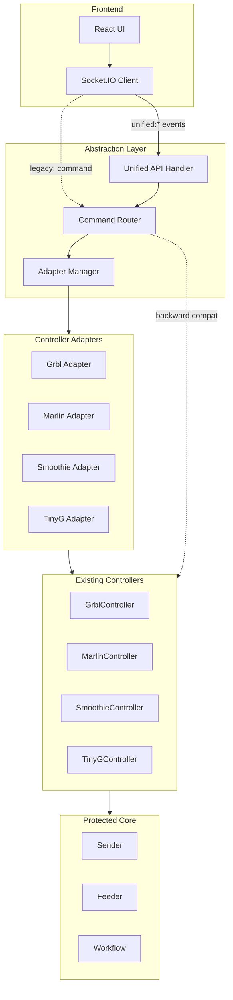

# Controller Abstraction Layer

## Architecture Overview



## Design Principles

1. **Unified Intent-Based API**: Frontend sends high-level intents (e.g., `unified:jog`, `unified:home`) not controller-specific commands
2. **Adapter Pattern**: Each controller type has an adapter that translates unified commands to controller-specific implementation
3. **Wrapper Approach**: Adapters wrap existing controllers, calling `controller.command()` methods - **no changes to protected code**
4. **Backward Compatibility**: Legacy Socket.IO `command` events continue to work, routed directly to controllers
5. **Socket.IO Only**: Keep real-time bidirectional communication for immediate feedback

## Unified API Specification

### Command Format

Socket.IO event: `unified:{operation}`

### Operations (Matching FE UI)

| Operation | Event | Parameters | Description |

|-----------|-------|------------|-------------|

| **Movement** |

| Jog | `unified:jog` | `{ axis: 'X'\|'Y'\|'Z', distance: number, feedrate?: number }` | Move relative distance |

| Rapid Move | `unified:rapidMove` | `{ x?: number, y?: number, z?: number }` | Move to absolute position (G0) |

| Home | `unified:home` | `{ axes?: string[] }` | Home specified axes or all |

| Set Zero | `unified:setZero` | `{ axis?: 'X'\|'Y'\|'Z' }` | Set work zero at current position |

| Go to Zero | `unified:goToZero` | `{}` | Rapid move to work zero |

| **Control** |

| Feedhold | `unified:feedhold` | `{}` | Pause motion |

| Cycle Start | `unified:cycleStart` | `{}` | Resume from feedhold |

| Emergency Stop | `unified:emergencyStop` | `{}` | Immediate stop |

| Reset | `unified:reset` | `{}` | Reset controller |

| Unlock | `unified:unlock` | `{}` | Unlock after alarm |

| **Spindle** |

| Spindle On | `unified:spindleOn` | `{ speed?: number, direction?: 'CW'\|'CCW' }` | Start spindle |

| Spindle Off | `unified:spindleOff` | `{}` | Stop spindle |

| Spindle Override | `unified:spindleOverride` | `{ value: number }` | Adjust spindle speed (%) |

| **Feed** |

| Feed Override | `unified:feedOverride` | `{ value: number }` | Adjust feed rate (%) |

| Rapid Override | `unified:rapidOverride` | `{ value: number }` | Adjust rapid rate (%) |

| **Probing** |

| Probe Z | `unified:probeZ` | `{ strategy: string, feedrate: number, distance: number }` | Probe for Z zero |

| **G-code** |

| Load File | `unified:loadFile` | `{ name: string, gcode: string }` | Load G-code file |

| Start Job | `unified:startJob` | `{}` | Start running loaded file |

| Pause Job | `unified:pauseJob` | `{}` | Pause running job |

| Resume Job | `unified:resumeJob` | `{}` | Resume paused job |

| Stop Job | `unified:stopJob` | `{}` | Stop running job |

| **Status** |

| Get Status | `unified:getStatus` | `{}` | Request status report (triggers `controller:state` response) |

### Response Format

All unified commands emit a response event: `unified:{operation}:response`

```javascript
socket.emit('unified:jog', port, { axis: 'X', distance: 10, feedrate: 1000 });
socket.on('unified:jog:response', (port, result) => {
  // result: { success: boolean, error?: string, data?: any }
});
```

## Implementation Plan

### Phase 1: Core Abstraction Infrastructure

**1.1 Create Unified API Handler**

- New file: `src/server/services/cncengine/UnifiedAPI.js`
- Listens for `unified:*` Socket.IO events
- Validates parameters
- Routes to appropriate adapter based on controller type
- Files: `src/server/services/cncengine/UnifiedAPI.js`

**1.2 Create Adapter Base Class**

- Abstract base class defining adapter interface
- All adapters must implement: `jog()`, `home()`, `spindleOn()`, etc.
- Files: `src/server/controllers/adapters/BaseAdapter.js`

**1.3 Create Adapter Manager**

- Factory pattern to get correct adapter for controller type
- Maps controller type (Grbl/Marlin/etc.) to adapter class
- Files: `src/server/services/cncengine/AdapterManager.js`

**1.4 Update CNCEngine**

- Register unified API handler alongside existing command handler
- Route `unified:*` events to UnifiedAPI, keep `command` events going to controllers directly
- Files: `src/server/services/cncengine/CNCEngine.js`

### Phase 2: Implement Controller Adapters

**2.1 Grbl Adapter**

- Maps unified operations to Grbl-specific commands:
  - `jog()` → Grbl native jog format: `$J=G91 G21 X10 F1000`
  - `home()` → `$H`
  - `spindleOn()` → `M3 S1000` or `M4 S1000`
  - `feedOverride()` → Real-time override codes (`\x90`, `\x91`, etc.)
- Files: `src/server/controllers/adapters/GrblAdapter.js`

**2.2 Marlin Adapter**

- Maps unified operations to Marlin-specific commands:
  - `jog()` → `G91 G0 X10 F1000` (relative mode)
  - `home()` → `G28` or `G28.2 X Y Z`
  - `spindleOn()` → `M3 S1000`
  - `feedOverride()` → `M220 S110` (percentage override)
- Files: `src/server/controllers/adapters/MarlinAdapter.js`

**2.3 Smoothie Adapter**

- Maps unified operations to Smoothie-specific commands
- Files: `src/server/controllers/adapters/SmoothieAdapter.js`

**2.4 TinyG Adapter**

- Maps unified operations to TinyG/g2core-specific commands
- Files: `src/server/controllers/adapters/TinyGAdapter.js`

### Phase 3: Command Mapping Details

**3.1 Jog Implementation**

Each adapter handles jogging differently:

- **Grbl**: Uses native `$J=` command with feedrate
- **Marlin**: Uses `G91 G0` (relative rapid) then `G90` (absolute)
- **Smoothie**: Uses `G91 G0` similar to Marlin
- **TinyG**: Uses JSON command format: `{"jv":{"1":10.0,"2":0.0,"3":0.0},"fr":1000}`

**3.2 Spindle Control**

- **Grbl**: `M3` (CW) / `M4` (CCW) / `M5` (off), speed via `S`
- **Marlin**: Same G-code but may have different startup behavior
- **Smoothie/TinyG**: Similar but check specific implementations

**3.3 Probing**

- Adapters handle zeroing strategies from settings
- Translate unified `probeZ()` to controller-specific probe commands
- Grbl: `G38.2 Z-10 F100`, Marlin: `G38.2 Z-10 F100`, etc.

**3.4 Feed/Rapid Overrides**

- **Grbl**: Real-time override codes (hex characters)
- **Marlin**: `M220 S110` (feed), `M221` (spindle)
- **Smoothie/TinyG**: Check implementations

### Phase 4: Integration & Testing

**4.1 Backward Compatibility**

- Legacy `command` events continue to work
- Both old and new API coexist
- Frontend can migrate gradually

**4.2 Error Handling**

- Unified API catches adapter errors
- Returns consistent error format: `{ success: false, error: "message" }`
- Logs adapter-specific errors for debugging

**4.3 Documentation**

- Document unified API in `docs/API.md`
- Add adapter implementation guide
- Migration guide for frontend

### Phase 5: Frontend Migration (Future)

**5.1 Update Socket Service**

- Add `unifiedCommand()` helper method
- Type definitions for unified API operations
- Files: `src/app/src/services/socket.ts`

**5.2 Migrate Setup Screen**

- Replace direct `controller.command()` calls with unified API
- Use `unified:jog`, `unified:home`, etc.
- Files: Setup screen panels

## File Structure

```
src/server/
├── services/
│   └── cncengine/
│       ├── CNCEngine.js              # Modified: route unified:* events
│       ├── UnifiedAPI.js             # New: unified API handler
│       └── AdapterManager.js         # New: adapter factory
├── controllers/
│   ├── adapters/                     # New directory
│   │   ├── BaseAdapter.js           # New: abstract base class
│   │   ├── GrblAdapter.js           # New: Grbl adapter
│   │   ├── MarlinAdapter.js         # New: Marlin adapter
│   │   ├── SmoothieAdapter.js       # New: Smoothie adapter
│   │   └── TinyGAdapter.js          # New: TinyG adapter
│   ├── Grbl/
│   │   └── GrblController.js        # Unchanged (protected)
│   ├── Marlin/
│   │   └── MarlinController.js      # Unchanged (protected)
│   └── ...
└── lib/
    ├── Sender.js                    # Unchanged (protected)
    ├── Feeder.js                    # Unchanged (protected)
    └── Workflow.js                  # Unchanged (protected)
```

## Adapter Interface (TypeScript Definition)

```typescript
interface CNCAdapter {
  // Controller instance this adapter wraps
  controller: GrblController | MarlinController | SmoothieController | TinyGController;
  
  // Movement operations
  jog(params: { axis: 'X' | 'Y' | 'Z', distance: number, feedrate?: number }): Promise<AdapterResult>;
  rapidMove(params: { x?: number, y?: number, z?: number }): Promise<AdapterResult>;
  home(params: { axes?: string[] }): Promise<AdapterResult>;
  setZero(params: { axis?: 'X' | 'Y' | 'Z' }): Promise<AdapterResult>;
  goToZero(): Promise<AdapterResult>;
  
  // Control operations
  feedhold(): Promise<AdapterResult>;
  cycleStart(): Promise<AdapterResult>;
  emergencyStop(): Promise<AdapterResult>;
  reset(): Promise<AdapterResult>;
  unlock(): Promise<AdapterResult>;
  
  // Spindle operations
  spindleOn(params: { speed?: number, direction?: 'CW' | 'CCW' }): Promise<AdapterResult>;
  spindleOff(): Promise<AdapterResult>;
  spindleOverride(params: { value: number }): Promise<AdapterResult>;
  
  // Feed operations
  feedOverride(params: { value: number }): Promise<AdapterResult>;
  rapidOverride(params: { value: number }): Promise<AdapterResult>;
  
  // Probing
  probeZ(params: { strategy: string, feedrate: number, distance: number }): Promise<AdapterResult>;
  
  // G-code operations
  loadFile(params: { name: string, gcode: string }): Promise<AdapterResult>;
  startJob(): Promise<AdapterResult>;
  pauseJob(): Promise<AdapterResult>;
  resumeJob(): Promise<AdapterResult>;
  stopJob(): Promise<AdapterResult>;
  
  // Status
  getStatus(): Promise<AdapterResult>;
}

interface AdapterResult {
  success: boolean;
  error?: string;
  data?: any;
}
```

## Example: GrblAdapter Implementation

```javascript
class GrblAdapter extends BaseAdapter {
  async jog(params) {
    const { axis, distance, feedrate = 1000 } = params;
    const axisUpper = axis.toUpperCase();
    
    // Grbl native jog: $J=G91 G21 X10 F1000
    const command = `$J=G91 G21 ${axisUpper}${distance} F${feedrate}`;
    
    try {
      this.controller.writeln(command);
      return { success: true };
    } catch (error) {
      return { success: false, error: error.message };
    }
  }
  
  async home(params = {}) {
    // Grbl homing: $H
    try {
      this.controller.writeln('$H');
      return { success: true };
    } catch (error) {
      return { success: false, error: error.message };
    }
  }
  
  async spindleOn(params = {}) {
    const { speed = 1000, direction = 'CW' } = params;
    const mCode = direction === 'CW' ? 'M3' : 'M4';
    const command = `${mCode} S${speed}`;
    
    try {
      this.controller.writeln(command);
      return { success: true };
    } catch (error) {
      return { success: false, error: error.message };
    }
  }
  
  // ... other methods
}
```

## Migration Strategy

1. **Phase 1-2**: Build abstraction layer alongside existing code (no breaking changes)
2. **Phase 3**: Test unified API with new frontend features (Setup screen)
3. **Phase 4**: Gradually migrate existing frontend code
4. **Phase 5**: Eventually deprecate legacy `command` events (optional, long-term)

## Testing Strategy

1. **Unit Tests**: Test each adapter's command translation
2. **Integration Tests**: Test unified API → adapter → controller flow
3. **E2E Tests**: Test full stack with real controller (or mock)
4. **Backward Compatibility Tests**: Verify legacy commands still work