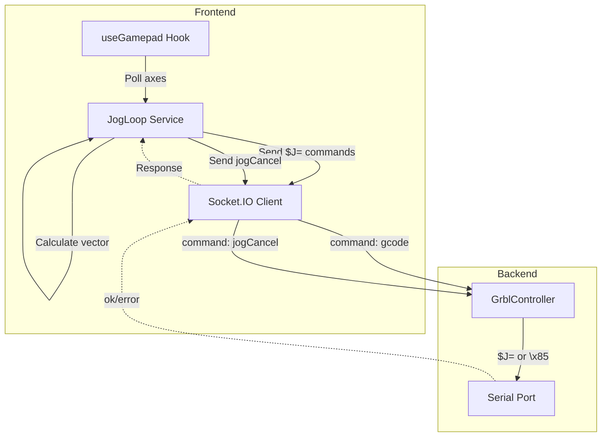

# Joystick Analog Jogging Implementation Plan

> Based on [Grbl v1.1 Jogging Documentation](https://github.com/gnea/grbl/wiki/Grbl-v1.1-Jogging)

## Overview

Implement continuous analog joystick jogging that follows Grbl's recommended methodology for low-latency, responsive control. The implementation will poll gamepad analog sticks, translate input to jog motion vectors, and send incremental `$J=` commands to keep Grbl's planner buffer full while maintaining minimal latency.

## Current State

- ✅ Joystick configuration UI exists (Settings page)
- ✅ Analog stick mappings configured (left_x/y, right_x/y → jog_x/y/z)
- ✅ Gamepad detection and polling infrastructure
- ✅ Grbl `jogCancel` command exists (`\x85`)
- ✅ Max jog speeds configurable (analogJogSpeedXY, analogJogSpeedZ)
- ❌ No continuous jog loop implementation
- ❌ No incremental jog command sending
- ❌ No jog cancel synchronization

## Architecture



## Implementation Plan

### Phase 1: Frontend - Gamepad Polling Service

**1.1 Create useGamepad Hook**
- Poll gamepad at 60fps (requestAnimationFrame)
- Apply deadzone filtering
- Apply sensitivity curve
- Handle axis inversion
- Return normalized axis values (-1 to 1)
- Files: `src/app/src/hooks/useGamepad.ts`

**1.2 Create JogLoop Service**
- Manages continuous jog command loop
- Tracks jog state (idle, jogging, cancelling)
- Queues jog commands with proper timing
- Handles jog cancel synchronization
- Files: `src/app/src/services/jogLoop.ts`

### Phase 2: Jog Command Generation

**2.1 Vector Calculation**
- Convert analog stick values to jog motion vector
- Support simultaneous multi-axis movement (XY, XZ, XYZ)
- Apply speed scaling based on stick deflection
- Respect max jog speeds from config (analogJogSpeedXY, analogJogSpeedZ)
- Files: `src/app/src/services/jogLoop.ts` (vector calculation)

**2.2 Incremental Distance Calculation**
Following Grbl's recommended math:
- `s = v * dt` where:
  - `s` = incremental distance (mm)
  - `v` = current jog feed rate (mm/sec, convert from mm/min)
  - `dt` = execution time increment (seconds)
- Constraints:
  - `dt > 10ms` (parsing/planning time)
  - `dt > v² / (2 * a * (N-1))` where:
    - `a` = acceleration (mm/sec²) - use smallest axis acceleration
    - `N` = 15 (Grbl planner blocks)
- Target: `dt` between 0.025-0.06 seconds for typical machines
- Files: `src/app/src/services/jogLoop.ts` (distance calculation)

**2.3 Jog Command Format**
- Format: `$J=G91 G21 X{sx} Y{sy} Z{sz} F{feedrate}`
- Use G91 (incremental) mode
- Use G21 (metric) or G20 (imperial) based on settings
- Feed rate in mm/min (G94 units)
- Files: `src/app/src/services/jogLoop.ts` (command generation)

### Phase 3: Command Loop Implementation

**3.1 Main Jog Loop**
Following Grbl's recommended methodology:
1. Read joystick signal and translate to jog motion vector
2. Calculate incremental distance based on feed rate and timing
3. Send short `$J=` command with incremental distance
4. Wait for 'ok' acknowledgement
5. Repeat loop while stick is deflected
6. If stick returns to neutral, send jog cancel command
7. Send `G4P0` after jog cancel for synchronization

**3.2 State Management**
- Track current jog state: `idle`, `jogging`, `cancelling`
- Track pending commands (waiting for 'ok')
- Track last sent position (for deterministic tracking)
- Files: `src/app/src/services/jogLoop.ts` (state management)

**3.3 Error Handling**
- Handle 'error' responses from Grbl
- Handle connection loss
- Handle gamepad disconnection
- Graceful degradation (stop jogging on error)
- Files: `src/app/src/services/jogLoop.ts` (error handling)

### Phase 4: Integration

**4.1 Connect to Setup Screen**
- Initialize jog loop when Setup screen mounts
- Start/stop based on joystick config enabled state
- Connect to selected gamepad
- Files: `src/app/src/routes/Setup/index.tsx`

**4.2 Socket.IO Integration**
- Send `command('gcode', '$J=...')` for jog commands
- Send `command('jogCancel')` for cancel
- Listen for 'ok' and 'error' responses
- Files: `src/app/src/services/jogLoop.ts` (socket integration)

**4.3 Controller State Integration**
- Check controller state before sending jog commands
- Only jog when in 'Idle' or 'Jog' state
- Handle state transitions gracefully
- Files: `src/app/src/services/jogLoop.ts` (state checks)

### Phase 5: Advanced Features

**5.1 Acceleration Awareness**
- Query or estimate machine acceleration settings
- Adjust `dt` calculation based on actual acceleration
- Provide better latency at slow speeds
- Files: `src/app/src/services/jogLoop.ts` (acceleration)

**5.2 Position Tracking**
- Track expected position from sent jog commands
- Update on jog cancel (query actual position)
- Use for visual feedback in 3D viewer
- Files: `src/app/src/services/jogLoop.ts` (position tracking)

**5.3 Multi-Controller Support**
- Support Grbl, Marlin, Smoothie, TinyG
- Each controller may need different jog command format
- Use unified API when available (future)
- Files: `src/app/src/services/jogLoop.ts` (controller abstraction)

## Technical Details

### Jog Command Examples

**Single axis (X+):**
```
$J=G91 G21 X0.5 F1000
```

**Multi-axis (XY diagonal):**
```
$J=G91 G21 X0.354 Y0.354 F1000
```

**Z axis:**
```
$J=G91 G21 Z0.1 F500
```

**Jog cancel:**
```
\x85 (0x85 realtime command)
```

**Synchronization after cancel:**
```
G4P0 (dwell 0 seconds - returns 'ok' when cancel complete)
```

### Timing Calculation Example

For a machine with:
- Max jog speed: 3000 mm/min = 50 mm/sec
- Acceleration: 500 mm/sec²
- Planner blocks: N = 15

Calculate `dt`:
- `dt > 10ms` ✓ (use 25ms minimum)
- `dt > v² / (2 * a * (N-1))` = `50² / (2 * 500 * 14)` = `2500 / 14000` = `0.179s`

So `dt = 0.179s` (179ms) minimum for max speed.

At this speed, incremental distance: `s = 50 * 0.179 = 8.95mm`

Total latency: `T = 0.179 * 15 = 2.7 seconds` at max speed.

At slower speeds (e.g., 500 mm/min = 8.33 mm/sec):
- `dt > 8.33² / (2 * 500 * 14)` = `69.4 / 14000` = `0.005s` (5ms)
- Use `dt = 25ms` (minimum constraint)
- `s = 8.33 * 0.025 = 0.21mm`
- Total latency: `T = 0.025 * 15 = 0.375s` (375ms) - much better!

### Deadzone and Sensitivity

**Deadzone:**
- Ignore stick values below threshold (e.g., 0.15 = 15%)
- Prevents drift from stick not returning to exact center
- Applied before sensitivity curve

**Sensitivity:**
- Apply curve to stick input (linear, exponential, etc.)
- Allows fine control near center, full speed at edges
- Default: linear (1.0x), can be adjusted for preference

## File Structure

```
src/app/src/
├── hooks/
│   └── useGamepad.ts              # Gamepad polling hook
├── services/
│   ├── jogLoop.ts                  # Main jog loop service
│   └── socket.ts                   # Socket.IO service (existing)
└── routes/
    └── Setup/
        └── index.tsx                # Setup screen (integrate jog loop)
```

## API Integration

### Current (Direct Socket.IO)
```typescript
// Send jog command
socketService.command('gcode', '$J=G91 G21 X0.5 F1000');

// Send jog cancel
socketService.command('jogCancel');

// Listen for responses
socketService.on('serialport:read', (data) => {
  if (data === 'ok') { /* command completed */ }
  if (data.startsWith('error:')) { /* handle error */ }
});
```

### Future (Unified API)
```typescript
// When unified API is implemented
socketService.unifiedCommand('unified:jog', {
  axis: 'X',
  distance: 0.5,
  feedrate: 1000
});
```

## Testing Strategy

1. **Unit Tests**
   - Vector calculation
   - Distance calculation with various speeds/accelerations
   - Deadzone and sensitivity application
   - Command format generation

2. **Integration Tests**
   - Full jog loop with mock socket
   - Jog cancel synchronization
   - Error handling
   - State transitions

3. **Manual Testing**
   - Test with real gamepad
   - Verify latency feels responsive
   - Test jog cancel responsiveness
   - Test multi-axis simultaneous movement
   - Test at various speeds

## Configuration

The jog loop will use existing joystick settings:
- `joystick.enabled` - Enable/disable jogging
- `joystick.selectedGamepad` - Which gamepad to use
- `joystick.analogMappings` - Stick to axis mappings
- `joystick.deadzone` - Deadzone threshold
- `joystick.sensitivity` - Sensitivity curve
- `joystick.invertX/Y/Z` - Axis inversion
- `joystick.analogJogSpeedXY` - Max XY jog speed (mm/min)
- `joystick.analogJogSpeedZ` - Max Z jog speed (mm/min)

## Safety Considerations

1. **State Checks**: Only jog when controller is in 'Idle' or 'Jog' state
2. **Emergency Stop**: Gamepad button can trigger emergency stop
3. **Soft Limits**: Grbl will reject jog commands that exceed machine travel
4. **Jog Cancel**: Always available via realtime command
5. **Connection Loss**: Stop jogging if connection lost
6. **Gamepad Disconnect**: Stop jogging if gamepad disconnected

## Future Enhancements

1. **Adaptive Timing**: Adjust `dt` based on actual machine response
2. **Inertial Feel**: Simulate momentum/decay for smoother feel
3. **Haptic Feedback**: Use gamepad rumble for tactile feedback
4. **Visual Feedback**: Show jog vector in 3D viewer
5. **Controller-Specific**: Optimize for Marlin, Smoothie, TinyG jogging
