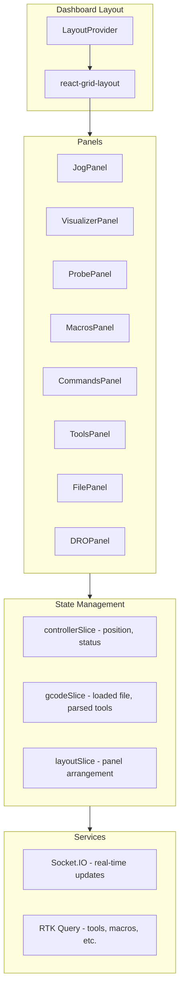

# Setup Dashboard Screen Plan

> Design specification for the FE designer agent

---

## User's Original Direction (Verbatim)

> I'd like to tackle the main screen next.  
> There should be different layouts depending on the intent:
> - **Setup**: A screen with jog controls, macros, probing, commands, tool library, ability to upload a model and view it visually
> - **Monitor**: A screen for while the job is running with a 3d visualization of the model, stats on runtime, buffers, time remaining, pause and stop buttons, the steps in the file (i.e. tool changes and carving time for each)
> - **Stats**: A collection of stats on the machine, carve time, distance travelled, mins and maxes, etc.
> - **Settings**: The settings page
>
> Let's start with Setup. It should be a modern dashboard interface with multiple windows. We want flexibility of workflow, but also to be opinionated. The user should be able to jog using on-screen controls or the joystick, probe for z using all the strategies available, outline the job using the spindle, visualize where the tool is on the board, visualize where zero is on the board, run commands, macros, and see (and edit) the tool library. When they upload a gcode file, it should highlight the tools that will be used in the library, create the visualization on the board, etc.

**On Tool Library:**
> We just need the tool name, diameter, and type, so the user knows which tool to grab out of the toolbox instead of just "T4"

**On Layout:**
> Draggable/resizable panels — user can rearrange and resize panels (like the legacy app)

**On 3D Visualization:**
> React Three Fiber — modern React-first wrapper for Three.js

---

## Overview

Build a modern dashboard Setup screen with draggable/resizable panels containing jog controls, 3D visualizer (React Three Fiber), probing, macros, commands, and a tool library that maps tool numbers to physical tool descriptions.

## Design Intent

The Setup screen is for **job preparation** — getting the machine ready before running a job:
- Jog the machine to position
- Probe for Z zero using touch plate
- Upload and visualize G-code
- See which tools are needed (with human-readable names, not just "T4")
- Outline the job using the spindle to verify positioning
- Run macros and commands

## Architecture



## Design Decisions

| Decision | Choice | Rationale |
|----------|--------|-----------|
| Layout system | Draggable/resizable panels | User can customize workflow, like legacy app |
| 3D visualization | React Three Fiber | Modern React-first DX, better component model than raw Three.js |
| Tool library | Simple database (name, diameter, type) | Practical — user knows which tool to grab from toolbox |
| State management | Redux + Socket.IO | Real-time position updates need centralized state |

## Implementation Phases

### Phase 1: Foundation

**1.1 Dashboard Layout System**
- Add `react-grid-layout` for draggable/resizable panels
- Create `DashboardLayout` component with persistence via Extensions API
- Create reusable `Panel` wrapper component (title bar, collapse, drag handle)
- Files: `src/app/src/routes/Setup/`, `src/app/src/components/Panel.tsx`

**1.2 Controller State Management**
- Create Redux slice for real-time controller state (position, status, modal groups)
- Wire Socket.IO events (`controller:state`, `sender:status`, `workflow:state`) to Redux
- Files: `src/app/src/store/controllerSlice.ts`

**1.3 Navigation/Routing**
- Add main screen routes: `/setup`, `/monitor`, `/stats`, `/settings`
- Create top-level nav header with mode switching
- Files: `src/app/src/routes/`, `src/app/src/App.tsx`

### Phase 2: Core Panels

**2.1 DRO (Digital Readout) Panel**
- Display machine position (MPos) and work position (WPos)
- X/Y/Z with semantic colors (red/green/blue)
- Coordinate system selector (G54-G59)
- Zero buttons per axis
- Files: `src/app/src/routes/Setup/panels/DROPanel.tsx`

**2.2 Jog Controls Panel**
- XY pad with directional buttons (or touch/click-drag area)
- Z up/down controls  
- Step distance selector (0.1, 1, 10, 100mm)
- Speed/feed rate control
- Keyboard shortcuts integration
- Joystick/gamepad support (use existing settings)
- Files: `src/app/src/routes/Setup/panels/JogPanel.tsx`

**2.3 3D Visualizer Panel (React Three Fiber)**
- Work envelope grid based on machine limits from settings
- Tool position indicator (real-time from controller state)
- Work zero marker
- G-code toolpath rendering when file loaded
- Camera controls (orbit, pan, zoom)
- Top/front/side view presets
- Files: `src/app/src/routes/Setup/panels/VisualizerPanel.tsx`, `src/app/src/components/Visualizer/`

### Phase 3: Operations Panels

**3.1 Probe Panel**
- Z probe with touch plate (use zeroing strategies from settings)
- Probe feedrate and distance controls
- Touch plate height setting
- Run probe button with safety confirmation
- Files: `src/app/src/routes/Setup/panels/ProbePanel.tsx`

**3.2 Macros Panel**
- List macros from API with run buttons
- Quick-add inline macro capability
- Files: `src/app/src/routes/Setup/panels/MacrosPanel.tsx`

**3.3 Commands Panel**  
- MDI (Manual Data Input) command entry
- Command history
- Quick command buttons from Commands API
- Files: `src/app/src/routes/Setup/panels/CommandsPanel.tsx`

### Phase 4: File & Tools

**4.1 File Panel**
- Upload G-code (drag-drop or file picker)
- Watch folder browser
- Parse loaded file for tool numbers
- Job outline button (trace perimeter with spindle off)
- Files: `src/app/src/routes/Setup/panels/FilePanel.tsx`

**4.2 Tool Library Panel**
- Tool database: tool number, name, diameter, type (endmill/V-bit/drill/etc.)
- CRUD via new `/api/tools` endpoint (or Extensions API)
- Highlight tools required by loaded G-code
- Inline editing
- Files: `src/app/src/routes/Setup/panels/ToolsPanel.tsx`

**4.3 Backend: Tool Library API**
- Add `/api/tools` endpoint for tool library CRUD
- Schema: `{ id, toolNumber, name, diameter, type }`
- Files: `src/server/api/api.tools.js`

### Phase 5: Integration

**5.1 G-code Parser**
- Parse tool changes (T1, T2, etc.) from loaded G-code
- Extract toolpath for 3D visualization
- Calculate job bounds for outline feature
- Files: `src/app/src/lib/gcodeParser.ts`

**5.2 Polish**
- Default panel layout preset
- Layout reset button
- Responsive breakpoints
- Loading states and error handling

## Key Dependencies

| Package | Purpose |
|---------|---------|
| `react-grid-layout` | Draggable/resizable panel system |
| `@react-three/fiber` | React wrapper for Three.js |
| `@react-three/drei` | Useful R3F helpers (OrbitControls, Grid, etc.) |

## File Structure

```
src/app/src/
├── routes/
│   ├── Setup/
│   │   ├── index.tsx              # Main dashboard
│   │   ├── DashboardLayout.tsx    # Grid layout wrapper
│   │   └── panels/
│   │       ├── DROPanel.tsx
│   │       ├── JogPanel.tsx
│   │       ├── VisualizerPanel.tsx
│   │       ├── ProbePanel.tsx
│   │       ├── MacrosPanel.tsx
│   │       ├── CommandsPanel.tsx
│   │       ├── FilePanel.tsx
│   │       └── ToolsPanel.tsx
│   ├── Monitor/                   # (future)
│   └── Stats/                     # (future)
├── components/
│   ├── Panel.tsx                  # Reusable panel wrapper
│   └── Visualizer/
│       ├── Scene.tsx              # Main R3F canvas
│       ├── WorkGrid.tsx           # Machine envelope grid
│       ├── ToolIndicator.tsx      # Current tool position
│       ├── Toolpath.tsx           # G-code path rendering
│       └── ZeroMarker.tsx         # Work zero indicator
├── store/
│   └── controllerSlice.ts         # Real-time machine state
└── lib/
    └── gcodeParser.ts             # G-code parsing utilities
```

## Panel Specifications

### DRO Panel
- **Purpose**: Show current machine and work position
- **Data source**: `controller:state` Socket.IO event
- **UI elements**:
  - X/Y/Z readouts with axis colors (red/green/blue)
  - Toggle between MPos (machine) and WPos (work) coordinates
  - Coordinate system dropdown (G54-G59)
  - Per-axis "Zero" buttons (sets current position as work zero)
  - "Go to Zero" button (rapid to work zero)

### Jog Panel
- **Purpose**: Move the machine manually
- **Data source**: Sends `command` via Socket.IO
- **UI elements**:
  - XY directional pad (8 directions or 4 + diagonals)
  - Z up/down buttons
  - Step distance selector: 0.01, 0.1, 1, 10, 100 mm
  - Continuous jog toggle (hold-to-move vs click-to-step)
  - Feed rate slider
  - Keyboard hints overlay

### Visualizer Panel
- **Purpose**: 3D view of work area, tool position, and G-code
- **Data source**: Machine limits from settings, position from controller state, toolpath from loaded G-code
- **UI elements**:
  - R3F Canvas with OrbitControls
  - Grid showing work envelope
  - Tool position cone/cylinder (updates in real-time)
  - Work zero marker (colored axes indicator)
  - Toolpath lines when G-code loaded (rapids as dashed, cuts as solid)
  - View preset buttons: Top, Front, Iso
  - Zoom-to-fit button

### Probe Panel
- **Purpose**: Z probing with touch plate
- **Data source**: Zeroing strategies from settings, sends probe commands
- **UI elements**:
  - Touch plate height input (remembers last value)
  - Probe strategy selector (from settings)
  - Probe feedrate input
  - "Probe Z" button with confirmation dialog
  - Status indicator (probing, success, failed)

### Macros Panel
- **Purpose**: Run saved G-code macros
- **Data source**: `/api/macros`
- **UI elements**:
  - List of macros with name and run button
  - Expand to see macro content
  - Link to settings to edit macros

### Commands Panel
- **Purpose**: Send manual G-code commands
- **Data source**: `/api/mdi`, command history in local state
- **UI elements**:
  - Text input for G-code command
  - Send button (or Enter key)
  - Command history dropdown (last 10-20 commands)
  - Quick command buttons from MDI API

### File Panel
- **Purpose**: Load G-code files
- **Data source**: `/api/gcode`, `/api/watch/files`
- **UI elements**:
  - Drag-drop zone
  - File picker button
  - Watch folder browser (tree view)
  - Loaded file info (name, lines, tools used)
  - "Outline Job" button (traces bounding box with spindle off)
  - "Unload" button

### Tools Panel
- **Purpose**: Map tool numbers to physical tools
- **Data source**: `/api/tools` (new), parsed tools from G-code
- **UI elements**:
  - Table: Tool #, Name, Diameter, Type
  - Inline edit capability
  - Add/delete tool buttons
  - Highlight row for tools needed by current job
  - Badge showing "T1, T3 needed for this job"

## Tool Library Schema

```typescript
interface Tool {
  id: string;           // UUID
  toolNumber: number;   // T1, T2, etc.
  name: string;         // "1/4 inch Flat Endmill"
  diameter: number;     // in mm
  type: ToolType;       // endmill | ballnose | vbit | drill | engraver
}

type ToolType = 'endmill' | 'ballnose' | 'vbit' | 'drill' | 'engraver' | 'other';
```

## Socket.IO Events Used

| Event | Direction | Data | Purpose |
|-------|-----------|------|---------|
| `controller:state` | Server → Client | Position, status, modal groups | Update DRO and visualizer |
| `sender:status` | Server → Client | Lines sent/total, hold state | Job progress |
| `workflow:state` | Server → Client | idle/running/paused | UI state |
| `command` | Client → Server | Command name + args | Jog, probe, run macro |
| `gcode:load` | Server → Client | File info | Update file panel |

## UI/UX Guidelines

- Follow existing design system from `aidocs/dev_prefs.md`
- Axis colors: X=red, Y=green, Z=blue (consistent throughout)
- Panel headers: use left accent border style from settings page
- Auto-save panel layout on change (debounced)
- Confirmation dialogs for destructive/movement commands
- Loading spinners during async operations
- Toast notifications for success/error feedback

