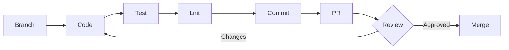

# Day-1 Developer Workflow

The typical development loop: branch → code → test → lint → commit → PR.

## Typical Loop



1. **Branch** - Create feature branch from `main`
2. **Code** - Make changes
3. **Test** - Run tests locally
4. **Lint** - Fix linting errors
5. **Commit** - Commit with conventional commit message
6. **PR** - Open pull request
7. **Review** - Address feedback, iterate

## Yarn Commands Cheat Sheet

### Development

```bash
# Start backend server (Terminal 1)
yarn dev:start-server

# Start frontend dev server (Terminal 2)
yarn dev:start-app

# Start Electron app
yarn dev:start-electron

# GRBL simulator
yarn dev:grblsim:setup    # One-time setup
yarn dev:grblsim:run      # Run simulator
```

### Testing

```bash
# Run all server tests
yarn test:test

# Run tests with coverage
yarn test:coverage

# Run linting (all checks)
yarn test:lint

# TypeScript type checking (frontend)
yarn test:typecheck
```

## Development Flow

### 1. Install Dependencies

```bash
yarn install
```

Installs dependencies for all workspaces.

### 2. Start GRBL Simulator (Optional)

For testing without hardware:

```bash
yarn dev:grblsim:setup    # One-time setup (clones grblsim repo)
yarn dev:grblsim:run       # Run simulator
```

Creates virtual serial port at `/dev/ttyFAKE` (Linux) that you can connect to.

### 3. Start Server

```bash
yarn dev:start-server
```

- Runs on `http://localhost:8000`
- Hot reload via nodemon
- Watches: `apps/server/src`, `packages/shared/src`

### 4. Start Frontend

```bash
yarn dev:start-app
```

- Runs on `http://localhost:5173`
- Hot reload via Vite
- Watches: `apps/web/src`

## Test Flow and Requirements

### Running Tests

```bash
# Server tests (tap framework)
yarn test:test

# With coverage report
yarn test:coverage
```

**Test framework:** [tap](https://node-tap.org/)

**Test location:** `apps/server/test/`

**Example test:**
```javascript
import { test } from 'tap';
import ModuleUnderTest from '../src/server/module/path';

test('test description', (t) => {
  t.equal(actual, expected, 'message');
  t.end();
});
```

### Linting

```bash
# Run all lint checks
yarn test:lint

# Individual checks
yarn test:lint:eslint    # JavaScript/TypeScript
yarn test:lint:web       # Frontend ESLint
yarn test:lint:i18n      # i18n JSON files
```

**ESLint config:** `.eslintrc.js` (root), workspace-specific configs

**Type checking:**
```bash
yarn test:typecheck  # TypeScript (frontend only)
```

## Build Flow (Reference)

Builds happen on CI runners, but you can test locally:

```bash
# Build all
yarn build:all

# Individual builds
yarn build:server   # Babel compile
yarn build:web      # Vite build
yarn build:shared   # TypeScript compile
yarn build:desktop  # Electron packaging
```

**Output locations:**
- `apps/server/dist/` - Compiled server code
- `apps/web/dist/` - Built frontend assets
- `apps/desktop/dist/` - Electron app bundle
- `out/` - Final packages (installers, .deb files)

## Debugging

### GRBL Simulator Settings

For faster development, configure the simulator after connecting:

1. **Enable homing:** Go to the Console tab and type `$22=1` to enable homing (`$H` command)
2. **Increase movement speeds:** Set axis speeds for faster testing:
   - `$110=10000` (X-axis max rate, mm/min)
   - `$111=10000` (Y-axis max rate, mm/min)
   - `$112=10000` (Z-axis max rate, mm/min)

Setting speeds to 10000 mm/min is a good starting point for faster development cycles.

### Logging Conventions

**Server (Winston):**
- Console logging only (default)
- File logging: ⚠️ **Needs setup** - looking for help getting file logging configured!
- Reduce noise - log errors and important events, not every operation

**Frontend:**

:::note Debug Mode
Enable debug mode by going to **Settings** and clicking "About" 10 times quickly. This creates an **Advanced Settings** section in Settings with a debug mode switch. When enabled, this:
- Shows a debug panel on the Setup and Monitor pages
- Enables additional logging for troubleshooting
- Provides detailed state information for development
:::

Browser console (F12) is also available for standard debugging.

### Profiling/Performance Tips

**Raspberry Pi 3 Target:**
- This code must run on RPi3 (minimal hardware)
- No databases - we use flat files instead
- Reduce calculations during G-code streaming to avoid CPU starvation
- CPU starvation during streaming can impact workpiece quality

**Performance considerations:**
- Minimize synchronous file I/O during active jobs
- Cache parsed G-code when possible
- Batch Socket.IO updates when possible
- Avoid heavy computations in hot paths (serial communication, streaming)

## Next Steps

- **[Code Standards](./05-code-standards.md)** - Coding conventions
- **[Testing Strategy](./06-testing-strategy.md)** - Detailed testing guide
- **[Contributing](./08-contributing.md)** - PR process
