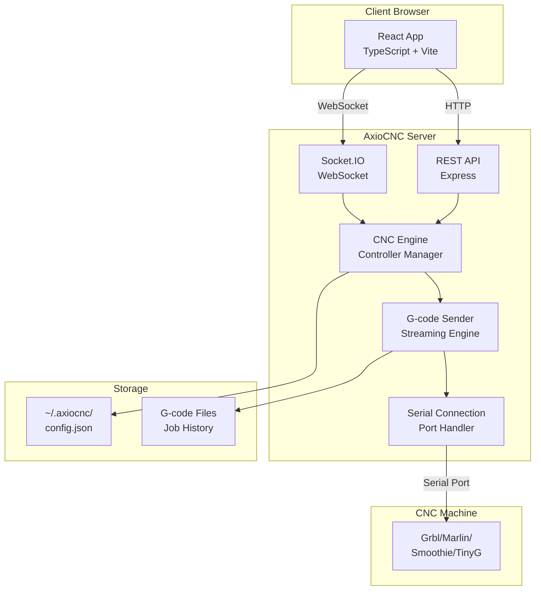
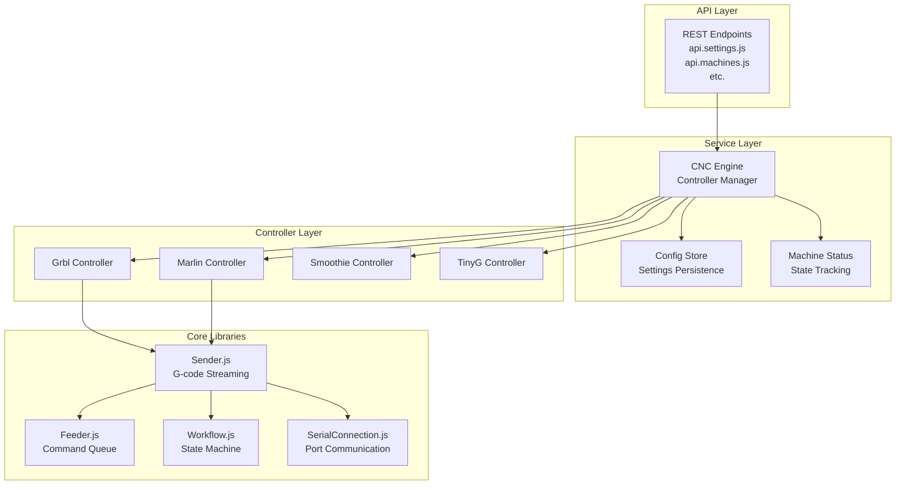

# Architecture

The mental model: how server, React app, WebSockets, serial port, and machine all relate.

## High-Level System Diagram



## Core Concepts / Domain Model

### G-code Abstraction

**Current state:** Lots of G-code parsing in the client (frontend)

**Ideal state:** Factor into "commands" abstracted above controllers

The frontend currently parses G-code for visualization and sends raw G-code strings to the server. The ideal architecture would have:
- **Command layer:** Abstract commands (move, tool change, probe, etc.)
- **Controller layer:** Translates commands to controller-specific G-code
- **Client:** Sends commands, not raw G-code

:::info
**Future work:** Command abstraction layer is planned but not yet implemented. See `ai/plans/controller-abstraction-layer-plan.md`.
:::

### Server Module Architecture



**Key modules:**
- **Sender.js** - G-code streaming engine (character-counting, send-response protocols)
- **Feeder.js** - Real-time command queue for jog/manual commands
- **Workflow.js** - State machine (idle/running/paused/stopped)
- **SerialConnection.js** - Serial port abstraction
- **Controllers** - Protocol-specific implementations (parse status, handle commands)

## Module Boundaries

### What Depends on What

**Safe to modify:**
- `apps/server/src/api/` - REST endpoints (translate HTTP → controller commands)
- `apps/server/src/services/` - High-level services (CNCEngine, ConfigStore, etc.)
- `apps/web/src/` - Frontend (all of it)

**Protected (extra care required):**
- `apps/server/src/controllers/**` - Controller implementations
- `apps/server/src/lib/Sender.js` - G-code streaming
- `apps/server/src/lib/Feeder.js` - Command queue
- `apps/server/src/lib/Workflow.js` - State machine
- `apps/server/src/lib/SerialConnection.js` - Serial communication

**Dependency flow:**
```
API → Services → Controllers → Core Libraries → Serial Port
```

Services depend on controllers, but controllers don't depend on services (one-way).

## Data/Storage

### Schemas

**Location:** `packages/shared/src/schemas/`

**Purpose:** Zod validation schemas shared between frontend and backend

**Example:** `settings.js` - Validates system settings structure

### Runtime Folder: `~/.axiocnc/`

**Structure:**
```
~/.axiocnc/
├── config.json          # Server configuration
├── sessions/            # Express session files
├── logs/                # Winston logs (if file logging enabled)
├── mediamtx/            # MediaMTX config and logs
│   ├── mediamtx.yml
│   └── logs/
├── jobhistory.json      # Job execution history
└── themes/              # Custom theme files
```

**Config file:** `~/.axiocnc/config.json`

**Default location:** Set via `apps/server/src/config/settings.base.js`

**Migrations:** Currently no migration system. Config structure changes require manual updates or defaults are applied.

### File Layouts

**G-code files:** Stored in user-specified directories (watch folders, upload locations)

**Job history:** Single JSON file (`jobhistory.json`) - flat file storage (no database)

**Themes:** JSON files in `~/.axiocnc/themes/`

## Third-Party Integrations

### MediaMTX

**Purpose:** Video streaming server for web camera feeds

**Integration:**
- Managed by `apps/server/src/services/mediamtx/MediaMTXManager.js`
- Configuration: `~/.axiocnc/mediamtx/mediamtx.yml`
- Logs: `~/.axiocnc/mediamtx/logs/`
- Bundled: Pre-built binaries in `apps/server/vendor/mediamtx/` (platform-specific)

**How it's abstracted:**
- MediaMTXManager handles lifecycle (start/stop/restart)
- Frontend connects to MediaMTX stream URL (not direct integration)
- Server proxies MediaMTX configuration through REST API

## Next Steps

- **[Code Standards](./05-code-standards.md)** - Coding conventions
- **[Making Changes Safely](./07-making-changes-safely.md)** - Protected code and security
