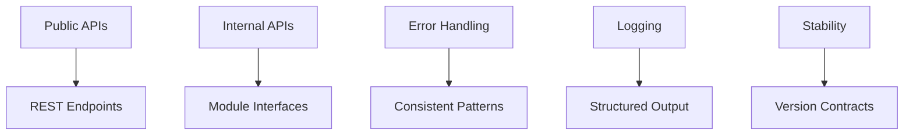

# API Philosophy

## What you'll learn

This section will describe the design principles and patterns used for AxioCNC's internal and external APIs to ensure consistency and maintainability.

## Public vs Internal APIs

This section will explain the distinction between user-facing REST APIs and internal module interfaces, with different stability guarantees.

[DETAILED CONTENT TO BE ADDED - API boundaries, versioning policies, breaking change handling]

## Error Handling

This section will describe the consistent error handling patterns used across the codebase for predictable failure modes.

[DETAILED CONTENT TO BE ADDED - Error types, logging standards, user feedback]

## Logging

This section will explain the logging strategy for debugging, monitoring, and audit trails throughout the application.

[DETAILED CONTENT TO BE ADDED - Log levels, structured logging, log aggregation]

## Stability Levels

This section will define the different stability levels (experimental, stable, deprecated) and their implications for API consumers.

[DETAILED CONTENT TO BE ADDED - Stability definitions, migration timelines, support policies]

<!-- Mermaid diagram to be added -->

## Next steps

Return to [getting-started.md](getting-started.md) for the complete development workflow or explore specific topics as needed.