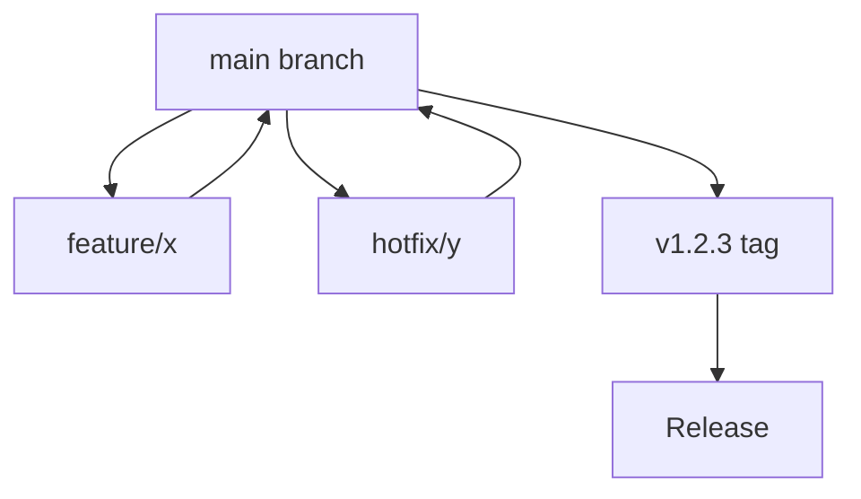

# Branch Strategy

## What you'll learn

This section will describe the version control workflow for developing features, fixing bugs, and releasing AxioCNC updates.

## Model

This section will explain the trunk-based development approach using main as the single source of truth with version tags (vX.Y.Z) driving releases.

[DETAILED CONTENT TO BE ADDED - Main branch policies, tag naming, release branches]

## Feature Branches

This section will describe how to create and manage short-lived feature branches for new functionality and bug fixes.

[DETAILED CONTENT TO BE ADDED - Branch naming, lifetime expectations, merge strategies]

## Hotfix Approach

This section will explain the process for urgent production fixes that bypass the normal feature development flow.

[DETAILED CONTENT TO BE ADDED - Hotfix branch creation, testing requirements, deployment]

## Why This Model

This section will provide the rationale for trunk-based development including faster feedback, reduced merge conflicts, and continuous integration benefits.

[DETAILED CONTENT TO BE ADDED - Benefits analysis, trade-offs, success metrics]

<!-- Mermaid diagram to be added -->

## Next steps

Continue to [pull-request-guidelines.md](pull-request-guidelines.md) to understand the code review and merge process.