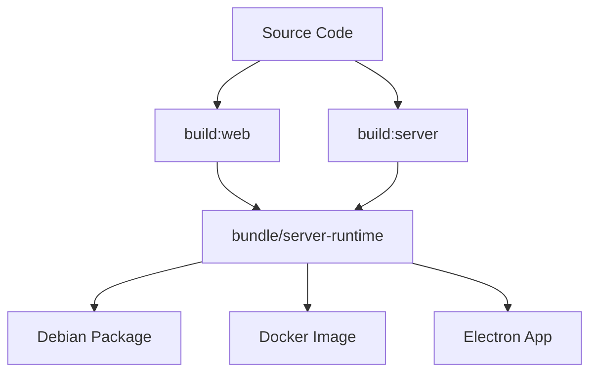

# Build and Bundle Contract

## What you'll learn

This section will describe the build pipeline that transforms source code into deployable artifacts and the contracts between build stages.

## Build Flow

This section will explain the sequence of build steps: build:web → build:server → bundle operations that produce the final artifacts.

[DETAILED CONTENT TO BE ADDED - Build scripts, artifact generation, version tagging]

## bundle/server-runtime Purpose

This section will define what the bundle/server-runtime directory contains and its role as the interface between build system and deployment targets.

[DETAILED CONTENT TO BE ADDED - Runtime contract, included files, configuration]

## Consumers

This section will describe how different deployment targets (Debian packages, Docker containers, Electron desktop app) consume the bundle artifacts.

[DETAILED CONTENT TO BE ADDED - Deb packaging, Docker integration, Electron embedding]

## Verification

This section will document the tests and checks that verify the bundle integrity and compatibility across different deployment scenarios.

[DETAILED CONTENT TO BE ADDED - Bundle validation tests, integration checks]

<!-- Mermaid diagram to be added -->

## Next steps

Continue to [branch-strategy.md](branch-strategy.md) to understand the version control workflow for making changes.