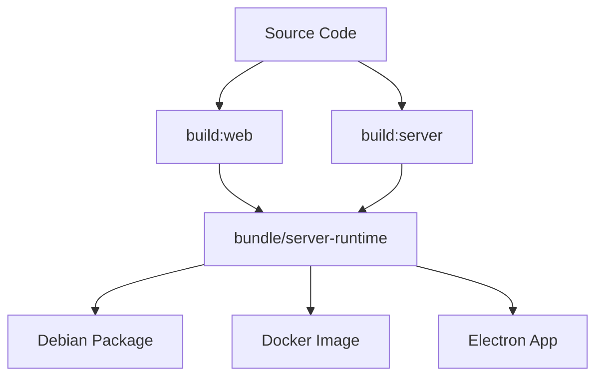

# Build and Bundle Contract

## What you'll learn

This section will describe the build pipeline that transforms source code into deployable artifacts and the contracts between build stages.

## Build Flow

This section will explain the sequence of build steps: build:web → build:server → bundle operations that produce the final artifacts.

[DETAILED CONTENT TO BE ADDED - Build scripts, artifact generation, version tagging]

## bundle/server-runtime Purpose

This section will define what the bundle/server-runtime directory contains and its role as the interface between build system and deployment targets.

[DETAILED CONTENT TO BE ADDED - Runtime contract, included files, configuration]

## Consumers

This section will describe how different deployment targets (Debian packages, Docker containers, Electron desktop app) consume the bundle artifacts.

[DETAILED CONTENT TO BE ADDED - Deb packaging, Docker integration, Electron embedding]

### Electron Development Requirements

When developing with Electron on Linux, you may need to install system libraries that Electron depends on. If you encounter errors like:


NOTE FOR THE AGENT THAT GENERATES THIS FILE FROM THIS SKELETON:  tHIS IS MOSTLY A SKELETON FILE, BUT THIS SECTION RIGHT BELOW NEEDS TO END UP IN THE TROUBLESHOOTING SECTION AND THE PRE-REQS SECTION FOR BUILDING ELECTRON.

```
error while loading shared libraries: libatk-1.0.so.0: cannot open shared object file
```

Install the required dependencies:

**For Ubuntu/Debian:**
```bash
sudo apt-get install -y \
  libatk1.0-0 \
  libatk-bridge2.0-0 \
  libcups2 \
  libdrm2 \
  libgtk-3-0 \
  libgbm1 \
  libasound2
```

**For Fedora/RHEL:**
```bash
sudo dnf install -y \
  atk \
  at-spi2-atk \
  cups-libs \
  libdrm \
  gtk3 \
  libgbm \
  alsa-lib
```

These libraries are required for Electron to run on Linux systems. They are typically included in desktop Linux distributions but may be missing on minimal server installations or WSL environments.

## Verification

This section will document the tests and checks that verify the bundle integrity and compatibility across different deployment scenarios.

[DETAILED CONTENT TO BE ADDED - Bundle validation tests, integration checks]

<!-- Mermaid diagram to be added -->



## Next steps

Continue to [branch-strategy.md](branch-strategy.md) to understand the version control workflow for making changes.