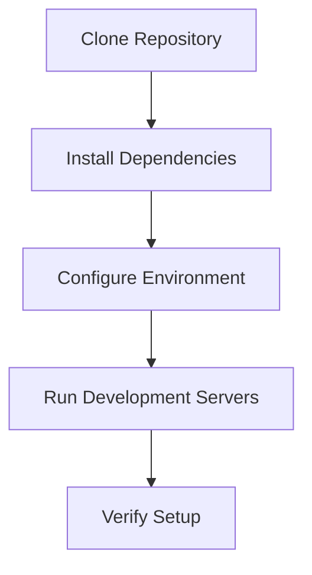

# Getting Started

## What you'll learn

This section will describe the learning outcomes for new contributors, including cloning the repository, setting up the development environment, running the application, and basic debugging workflows.

## When to read this

This section will explain that this page is the first stop for new contributors who want to go from zero to making their first meaningful contribution to AxioCNC.

## Prerequisites

This section will describe the required software dependencies including Node.js, yarn package manager, udev rules for serial device access, and any hardware requirements for CNC development.

[DETAILED CONTENT TO BE ADDED - Node versions, yarn setup, system dependencies]

## Steps Overview

This section will provide a high-level overview of the setup process including repository cloning, dependency installation, configuration, and initial testing.

[DETAILED CONTENT TO BE ADDED - Step-by-step commands for clone, install, configure]

## Debugging Setup

This section will describe how to configure development tools like VS Code for debugging the frontend (apps/web), backend (apps/server), and Electron app (apps/desktop).

[DETAILED CONTENT TO BE ADDED - VS Code launch configurations, logging setup, breakpoint placement]

## Common First Errors

This section will document typical onboarding issues like serial port permissions, build failures, and environment configuration problems with their solutions.

[DETAILED CONTENT TO BE ADDED - Error patterns and fixes]

<!-- Mermaid diagram placeholder for development setup flow -->

## Next steps

Continue to [repo-layout.md](repo-layout.md) to understand the project structure and where different types of code belong.