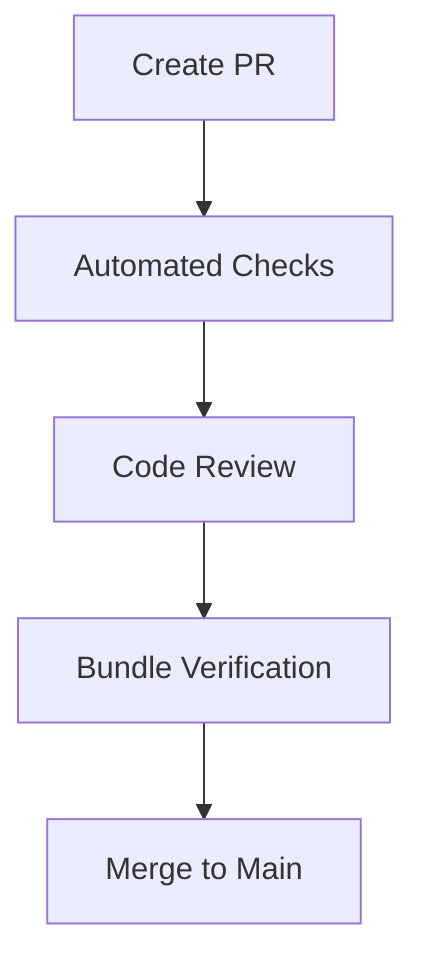

# Pull Request Guidelines

## What you'll learn

This section will describe the process and expectations for submitting code changes through pull requests to ensure quality and maintainability.

## PR Checklist Placeholder

This section will provide the complete checklist that must be completed before a pull request can be merged.

[DETAILED CONTENT TO BE ADDED - Code review requirements, testing verification, documentation updates]

## Commit Messages

This section will explain the conventional commit format used for atomic, meaningful commit messages that drive the changelog.

[DETAILED CONTENT TO BE ADDED - Commit format, examples, automation]

## Review Etiquette

This section will describe the code review process including reviewer responsibilities, author responses, and resolution workflows.

[DETAILED CONTENT TO BE ADDED - Review timeline, feedback guidelines, approval criteria]

## Bundle Verification Requirement

This section will explain the mandatory bundle verification step that ensures changes work across all deployment targets (Debian, Docker, Electron).

[DETAILED CONTENT TO BE ADDED - Bundle testing commands, verification criteria]

<!-- Mermaid diagram to be added -->

## Next steps

Continue to [testing-strategy.md](testing-strategy.md) to understand how to write and run tests for your changes.