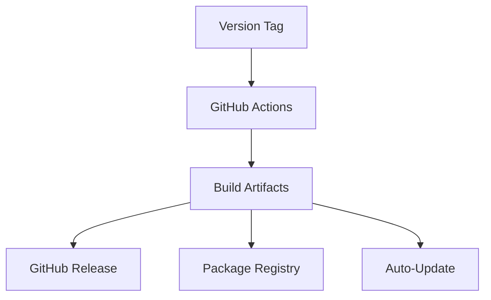

# Release Process

## What you'll learn

This section will describe how code changes progress from main branch commits to user-available releases across all platforms.

## Tag → Workflow Flow

This section will explain how version tags (vX.Y.Z) automatically trigger the GitHub Actions workflows that build and deploy releases.

[DETAILED CONTENT TO BE ADDED - Tag creation, workflow triggers, artifact generation]

## Artifact Paths

This section will document where different build artifacts are stored and how they map to deployment targets (GitHub releases, package repositories).

[DETAILED CONTENT TO BE ADDED - Artifact locations, naming conventions, retention policies]

## Version Propagation

This section will explain how version numbers flow from package.json through bundle metadata to final user-facing version strings.

[DETAILED CONTENT TO BE ADDED - Version bumping, sync requirements, validation]

## Troubleshooting

This section will document common release issues like build failures, deployment blocks, and rollback procedures.

[DETAILED CONTENT TO BE ADDED - Failure patterns, debugging steps, recovery procedures]

<!-- Mermaid diagram to be added -->

## Next steps

Continue to [api-philosophy.md](api-philosophy.md) to understand the design principles for AxioCNC's APIs.