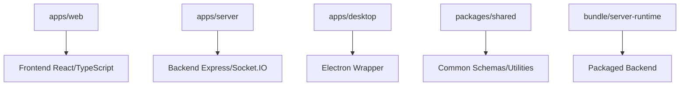

# Repository Layout

## What you'll learn

This section will describe how to navigate the AxioCNC codebase by understanding the folder structure and responsibilities of each major directory.

## High Level Structure

This section will map the main directories (apps/web, apps/server, apps/desktop, packages/shared, bundle/server-runtime) to their architectural roles and development workflows.

[DETAILED CONTENT TO BE ADDED - apps/ structure, packages/, bundle/ purpose]

## Where to Put New Code

This section will provide guidance on where to add new features based on their type (frontend UI, backend API, shared utilities, build artifacts).

[DETAILED CONTENT TO BE ADDED - Decision tree for code placement]

## What NOT to Add

This section will describe the rules for avoiding duplicate dependencies, maintaining separation between frontend/backend concerns, and preventing circular imports.

[DETAILED CONTENT TO BE ADDED - Anti-patterns and boundaries]

<!-- Mermaid diagram to be added -->

## Next steps

Continue to [build-and-bundle-contract.md](build-and-bundle-contract.md) to understand how the different parts fit together in the build pipeline.