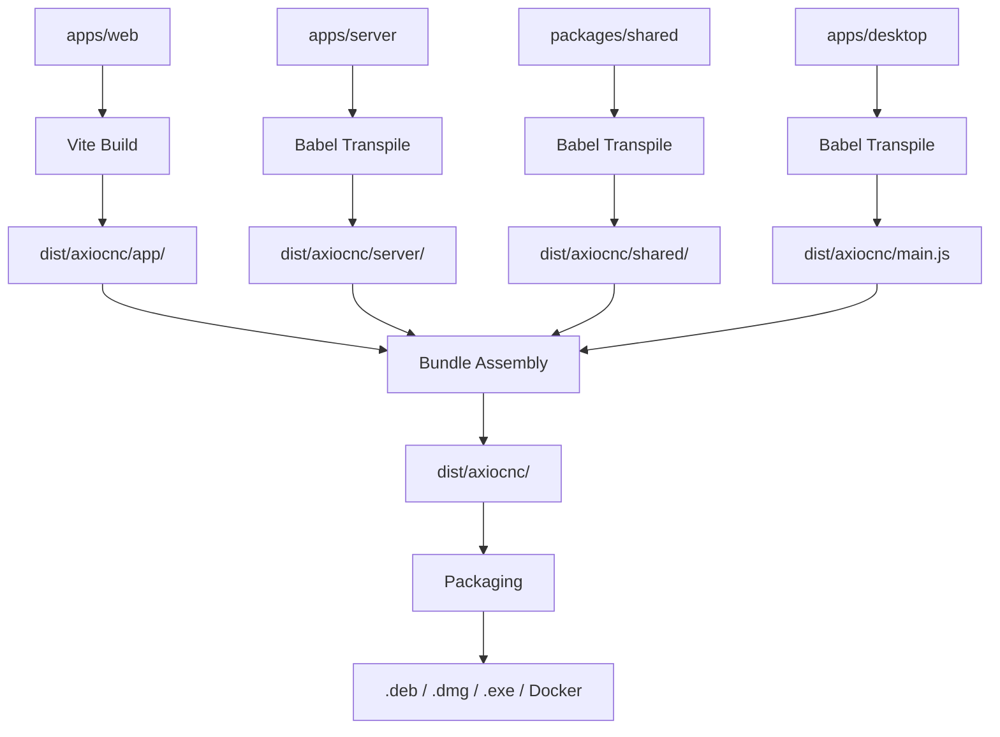

# Repository Layout

## What you'll learn

- Every top-level folder's purpose and what belongs there
- Where to add new server features, UI changes, and shared utilities
- Which outputs are generated versus committed to git
- How the build process connects the apps into deployable artifacts
- Common anti-patterns to avoid when extending the codebase

## High Level Structure

AxioCNC uses a monorepo structure with Yarn workspaces to manage three applications and shared packages.

```
repo/
├── apps/                          # Application source code
│   ├── web/                       # React SPA frontend
│   ├── server/                    # Express + Socket.IO backend
│   └── desktop/                   # Electron desktop app
├── packages/                      # Shared code and utilities
│   └── shared/                    # Common schemas and validation
├── developers/                    # Development tools and resources
│   ├── examples/                  # G-code examples and tools
│   └── scripts/                   # Build and deployment scripts
├── website/                       # Website and documentation
│   ├── docs/                      # User and developer documentation sites
│   │   ├── developer/             # Developer documentation (Docusaurus)
│   │   └── user/                  # User documentation (Docusaurus)
│   └── static/                    # Static website assets (axiocnc.com)
├── .github/workflows/             # CI/CD pipeline definitions
├── dist/                          # Build outputs (gitignored)
└── output/                        # Package artifacts (gitignored)
```

## Folder Responsibilities

### apps/web/

**Purpose**: Modern React/TypeScript frontend built with Vite, Tailwind CSS, and shadcn/ui components.

**What belongs here**:
- React components and pages
- TypeScript interfaces and API types
- Redux Toolkit store and RTK Query API slices
- Socket.IO client services
- Static assets (images, fonts)
- Theme configuration and CSS variables

**Example files**:
- `src/routes/Settings/index.tsx` - Settings page component
- `src/services/api.ts` - RTK Query API definitions
- `src/store/index.ts` - Redux store configuration

### apps/server/

**Purpose**: Express.js backend providing REST API, WebSocket real-time communication, and CNC controller management.

**What belongs here**:
- Express routes and middleware
- Socket.IO event handlers
- CNC controller implementations (Grbl, Marlin, TinyG, etc.)
- G-code streaming and workflow management
- Configuration management and validation
- Authentication and session handling

**Example files**:
- `src/controllers/grbl/GrblController.js` - Grbl protocol implementation
- `src/lib/Sender.js` - G-code streaming engine
- `src/api/api.settings.js` - REST API endpoints

:::warning
The server contains safety-critical G-code sender components. Bugs can cause machine crashes, tool breakage, or injury. See [protected-code.md](../../guidelines/protected-code.md) for modification guidelines.
:::

### apps/desktop/

**Purpose**: Electron application that bundles the server and web frontend into a native desktop experience.

**What belongs here**:
- Electron main process code
- Window management and system integration
- Native menus and dialogs
- Auto-updater logic
- Platform-specific build configurations

**Example files**:
- `src/main.js` - Electron main process entry point
- `build-resources/` - Platform-specific icons and installers

### packages/shared/

**Purpose**: Common utilities, schemas, and validation logic shared between applications.

**What belongs here**:
- Zod validation schemas for API requests/responses
- TypeScript type definitions
- Utility functions for data transformation
- Constants and enumerations

**Example files**:
- `src/schemas/settings.js` - Settings validation schema
- `src/schemas/index.d.ts` - TypeScript definitions

### developers/scripts/

**Purpose**: Build orchestration, packaging, and deployment automation scripts.

**What belongs here**:
- Production build scripts (`build-prod.sh`)
- Debian packaging for Raspberry Pi (`build-server-deb.sh`)
- Electron app building (`electron-builder.sh`)
- Docker image creation
- Development environment setup

**Example files**:
- `build-prod.sh` - Production build orchestration
- `grblsim/` - GRBL simulator setup scripts

### .github/workflows/

**Purpose**: GitHub Actions CI/CD pipeline definitions for automated testing, building, and releasing.

**What belongs here**:
- Multi-platform build jobs (Linux, macOS, Windows)
- Automated testing and linting
- Release artifact generation
- Docker Hub publishing

**Example files**:
- `ci.yml` - Main CI pipeline for all platforms
- `website.yml` - Documentation site deployment

## Dependency Flow



The build process transforms source TypeScript/JavaScript into deployable artifacts in the `dist/` directory, then packages them for distribution.

## Where to Put New Work

### Feature in server

**Location**: `apps/server/src/`
- API endpoints → `src/api/`
- Controller logic → `src/controllers/`
- Real-time features → `src/lib/` or `src/services/`
- Configuration → `src/config/`

### UI change

**Location**: `apps/web/src/`
- New pages → `src/routes/`
- Components → `src/components/`
- State management → `src/store/` or `src/services/`
- Styling → Tailwind classes or `src/styles/`

### Shared library

**Location**: `packages/shared/src/`
- Validation schemas → `src/schemas/`
- Utility functions → `src/utils/`
- Type definitions → `src/types/`

### Packaging change

**Location**: `developers/scripts/`
- Build scripts → Add to existing build pipeline
- Package configuration → Update electron-builder.json or deb templates
- Deployment → Add to existing deployment scripts

:::note
Bundle and packaging directories don't exist yet - they're part of the target architecture described in the monorepo modernization plan. For now, packaging changes should modify the build scripts in `developers/scripts/`.
:::

## Anti-Patterns

### Creating new build outputs outside dist/

All build artifacts must flow through the established `dist/` directory structure. Don't create additional output directories or modify the build pipeline to write files elsewhere.

### Bypassing the shared packages

Don't duplicate validation logic or utilities between apps. If code is used in multiple places, it belongs in `packages/shared/`.

### Mixing user docs with developer docs

User-facing documentation goes in `website/docs/user/`, developer documentation in `website/docs/developer/`. Don't add implementation details to user docs or user workflow instructions to developer docs.

### Adding dependencies outside workspace packages

All new dependencies should be added to the appropriate workspace package.json file (`apps/*/package.json` or `packages/*/package.json`), not the root package.json.

```bash
# Example: Adding a new dependency to the web app
cd apps/web
yarn add new-package
```

## Next steps

Continue to [build-and-bundle-contract.md](build-and-bundle-contract.md) to understand how the different parts fit together in the build pipeline.