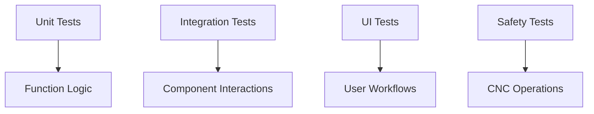

# Testing Strategy

## What you'll learn

This section will describe the testing approach used to ensure AxioCNC reliability, including different test types and their purposes.

## Types of Tests

This section will explain unit tests for individual functions, integration tests for component interactions, and safety tests for CNC operations.

[DETAILED CONTENT TO BE ADDED - Test categories, coverage goals, execution timing]

## Serialport Mocking

This section will describe how to mock serial port communications for testing CNC controller interactions without physical hardware.

[DETAILED CONTENT TO BE ADDED - Mock setup, common patterns, validation]

## UI Tests

This section will explain testing strategies for the frontend interface including component testing and end-to-end user workflows.

[DETAILED CONTENT TO BE ADDED - Testing tools, UI test patterns, headless execution]

## How to Add Tests

This section will provide guidance on writing tests for new code including test file locations, naming conventions, and integration with CI.

[DETAILED CONTENT TO BE ADDED - Test file structure, mocking strategies, CI integration]

<!-- Mermaid diagram to be added -->

## Next steps

Continue to [release-process.md](release-process.md) to understand how tested code gets deployed to users.